# Parichay System Architecture

Parichay is designed from first principles as an offline-only client application. It guarantees that user contact information never touches an external server, proxy, analytics service, or third-party database.

---

## 1. High-Level Architectural Diagram

```mermaid
graph TD
    subgraph UI ["Presentation Layer (React 19 + Tailwind CSS 4)"]
        Router["React Router v7"]
        HomeScreen["CardHomeScreen (/)"]
        Editor["CardEditorScreen (/editor)"]
        Studio["StyleStudioScreen (/studio)"]
        QRFull["QRFullscreenScreen (/qr/fullscreen)"]
        Share["ShareScreen (/share)"]
        Wallet["WalletGuideScreen (/wallet)"]
        Wallpaper["WallpaperScreen (/wallpaper)"]
        Settings["SettingsScreen (/settings)"]
        Showcase["ShowcaseScreen (/showcase)"]
        Help["HelpScreen (/index-help)"]
    end

    subgraph Core ["Domain & Processing Engines"]
        VCardEngine["vCard 3.0 Engine (Compact & Full RFC 6350)"]
        QREngine["QR Matrix & Canvas Renderer (qrcode + jsqr)"]
        Normalizers["Contact Normalizers (libphonenumber-js + Zod)"]
        WallpaperEngine["Lock-Screen Wallpaper Generator (Safe Zones)"]
        WalletEngine["1080x1350 Pass Photo Generator"]
    end

    subgraph Storage ["Dual Storage Layer"]
        StorageAdapter["Storage Adapter Router"]
        IDBAdapter["Web: idb-keyval (IndexedDB)"]
        CapPrefAdapter["Native: @capacitor/preferences"]
    end

    subgraph NativePlugin ["Native Platform Bridge (Capacitor 8)"]
        DeviceTools["DeviceTools Plugin (Kotlin / Swift)"]
        StatusBar["@capacitor/status-bar"]
        Notifications["@capacitor/local-notifications"]
        Haptics["@capacitor/haptics"]
        AppLifecycle["@capacitor/app"]
    end

    subgraph OfflinePWA ["Offline Service Worker & Caching"]
        Workbox["VitePWA / Workbox SW"]
        CacheStore["246+ Bundled Fonts & Static Assets"]
    end

    Router --> HomeScreen & Editor & Studio & QRFull & Share & Wallet & Wallpaper & Settings & Showcase & Help
    Editor --> Normalizers --> VCardEngine
    Studio --> QREngine
    Wallpaper --> WallpaperEngine --> QREngine
    Wallet --> WalletEngine --> QREngine
    HomeScreen --> VCardEngine --> QREngine

    HomeScreen & Editor & Studio & Settings --> StorageAdapter
    StorageAdapter --> IDBAdapter
    StorageAdapter --> CapPrefAdapter

    HomeScreen & QRFull & Wallpaper & Wallet --> DeviceTools
    HomeScreen & QRFull & Settings --> StatusBar
    Settings & Editor --> Notifications
    Router --> AppLifecycle
    Workbox --> CacheStore
```



---

## 2. Module Boundaries & Responsibilities

### Presentation Layer (`src/web/features/` & `src/web/components/`)
- Single-page application built on React Router 7.
- Zero server-side rendering; pure client execution.
- Visual tokens strictly driven by `design/tokens/tokens.json` compiled to CSS custom properties.

### Domain & Processing Layer (`src/shared/` & `src/web/lib/`)
- `src/shared/vcard.ts`: Generates byte-efficient RFC 6350 vCard strings. Features multibyte UTF-8 75-octet line folding and field minimization.
- `src/shared/normalizers.ts`: Uses `libphonenumber-js` to produce E.164 and RFC 3966 compliant phone numbers and cleans URIs.
- `src/web/lib/qr-renderer.ts`: Custom Canvas renderer supporting rounded modules, circular dots, custom finder corners, and center avatar plates.
- `src/web/lib/scan-check.ts`: Optical validation pipeline using `jsQR` to decode the rendered canvas and ensure mobile cameras can read the QR.

### Storage Abstraction (`src/web/lib/storage.ts`)
- Detects the platform runtime via `Capacitor.isNativePlatform()`.
- On Web & PWA: delegates to IndexedDB via `idb-keyval`.
- On Native Android & iOS: delegates to `@capacitor/preferences`.
- Backed by an in-memory fallback for environments with blocked storage.

---

## 3. The `DeviceTools` Native Plugin

To avoid third-party cloud-based wallet and wallpaper services, Parichay ships with an in-repo native plugin (`DeviceTools`):

```text
src/native/device-tools.ts  (TypeScript API)
       │
       ├── android/app/src/main/java/dev/parichay/app/plugins/DeviceToolsPlugin.kt
       └── ios/App/App/DeviceToolsPlugin.swift
```

### Supported Native Capabilities
1. `setLockScreenWallpaper(dataUrl, alsoHome)`:
   Uses Android `WallpaperManager.getInstance(context).setBitmap(bitmap, null, true, WallpaperManager.FLAG_LOCK)`.
2. `openWallpaperPicker()`:
   Launches the Android system wallpaper intent (`Intent.ACTION_SET_WALLPAPER`).
3. `openGoogleWallet()`:
   Launches the Google Wallet application intent directly (`com.google.android.apps.walletnfcrel`) with fallback to the web landing.
4. `saveImageToGallery(dataUrl, filename)`:
   Writes directly to Android `MediaStore.Images.Media` in the `Pictures/Parichay` collection with scoped storage permissions.
5. `keepScreenOn(enabled)`:
   Sets `FLAG_KEEP_SCREEN_ON` on the Android Window during fullscreen QR presentation to maximize optical scan success.

---

## 4. Build Pipeline & Offline PWA

```text
Source Code (.tsx, .ts, tokens.json)
       │
       ├── 1. npm run tokens:build   ──> Generates src/web/styles/tokens.css
       ├── 2. npm run brand:build    ──> Generates SVG logos, splash & PWA icons
       ├── 3. vite build             ──> Compiles TSX and CSS with Rollup
       └── 4. VitePWA (Workbox)      ──> Precaches 246+ local web fonts and assets into dist/sw.js
               │
               ├── Deployed to static host / PWA
               └── Copied via npx cap sync to android/ & ios/ assets
```

---

*Designed & developed by [Omkar Kardile](https://omkardile.is-a.dev/)*
